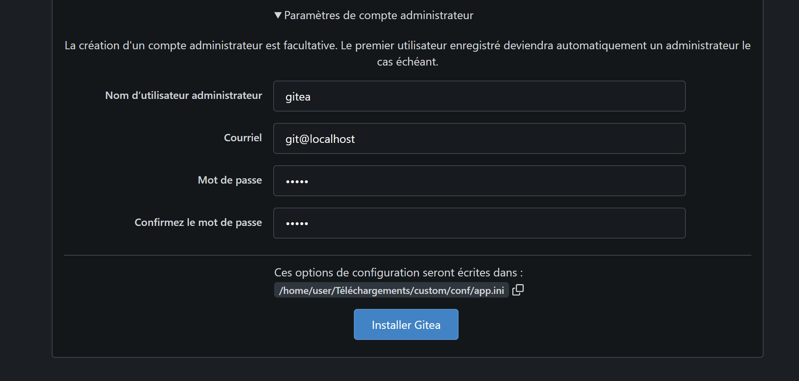

---
## Le titre est déjà écrit à l'aide de la cover externe [./cover/cover.html]
papersize: a4
fontsize: 11pt
geometry: margin=2.5cm
toc: true
toc-depth: 3
toc-title: "Sommaire"
documentclass: article
lang: fr
---

## Introduction

Ce document présente le travail réalisé durant la première semaine de la SAE 2.03[^intro1]. Il répond aux questions techniques posées dans le cadre de la configuration matérielle de la machine virtuelle sous VirtualBox. Ce rapport décrit **ce que nous avons fait** et **comment nous l'avons fait**, conformément aux consignes techniques fournies.

[^intro1]: La SAE 2.03 fait partie du programme du BUT Informatique et vise à développer des compétences en administration système et réseau.

> **Récapitulatif général de la démarche :** Nous avons lu attentivement les consignes fournies dans le document technique ainsi que les rapports des semaines précédentes. Nous avons reproduit les réponses attendues tout en respectant les paramètres techniques imposés. Ce rapport a été rédigé en Markdown avec une mise en forme optimisée pour une conversion facile via Pandoc en HTML et PDF.

## I. Configuration matérielle dans VirtualBox

Dans cette première étape, nous avons configuré une machine virtuelle sous VirtualBox[^vm1] pour installer un environnement Debian fonctionnel. Nous avons commencé par lancer VirtualBox et créer une nouvelle machine virtuelle en sélectionnant l'option **Debian 64-bit**. Après avoir défini le nom de la VM comme **sae203**, nous avons ajusté les paramètres en attribuant **2048 Mo de RAM** et un **disque dur de 20 Go**, en choisissant une allocation dynamique pour optimiser l'espace de stockage.

[^vm1]: VirtualBox est un logiciel de virtualisation développé par Oracle qui permet d'exécuter plusieurs systèmes d'exploitation sur une même machine physique.

Nous avons ensuite vérifié la configuration réseau par défaut en nous rendant dans les **paramètres de la VM**, sous l'onglet **Network**. Nous avons constaté que VirtualBox utilise par défaut le mode **NAT (Network Address Translation)**[^nat], ce qui permet à la machine virtuelle d'accéder à Internet via la connexion de l'hôte sans nécessiter de configuration spécifique.

[^nat]: Le NAT (Network Address Translation) est une technique permettant de modifier les adresses réseau dans les en-têtes IP des paquets, utilisée ici pour permettre à la VM de partager la connexion Internet de l'hôte.

#### Q&A {#I-q1}

**1. Que signifie "64-bit" dans "Debian 64-bit" ?**

Une distribution 64-bit est conçue pour des processeurs capables de gérer des instructions sur 64 bits, ça permet une gestion de la mémoire et des calculs plus efficace qu'en 32 bits.

**2. Quelle est la configuration réseau utilisée par défaut ?**

Par défaut, VirtualBox configure le réseau en mode NAT (Network Address Translation), qui permet à la machine virtuelle d'accéder à Internet via la connexion de l'hôte.

**3. Quel est le nom du fichier XML contenant la configuration de votre machine ?**

Le fichier XML se nomme généralement « login.vbox » (porte le nom choisi pour la VM) et se trouve dans le répertoire de la machine virtuelle.

**4. Sauriez-vous le modifier directement pour mettre 2 processeurs à votre machine ?**

Oui. Il suffit d'éditer le fichier XML et de modifier la balise correspondante (par exemple, en passant de `<CPU>` par `<CPU count="2">`), puis de sauvegarder le fichier pour que VirtualBox prenne en compte le changement.

## II. Installation de l'OS de base

Une fois la machine virtuelle configurée, nous avons procédé à l'installation du système d'exploitation Debian[^debian1]. Nous avons commencé par télécharger l'image ISO de Debian en version **64-bit** depuis le [site officiel](https://www.debian.org/distrib/).

[^debian1]: Debian est une distribution Linux réputée pour sa stabilité et son engagement envers les logiciels libres, créée en 1993 par Ian Murdock.

Durant l'installation, nous avons sélectionné **le français** comme langue principale et laissé les paramètres réseau en configuration automatique. Lors du choix des logiciels à installer, nous avons opté pour l'environnement de bureau **MATE**[^mate] plutôt que **GNOME**, afin de privilégier un environnement graphique plus léger, mieux adapté aux machines virtuelles, et pour retranscrire notre environnement présent en salle TP. Nous avons également installé un **serveur web** et un **serveur SSH**[^ssh] pour permettre une gestion à distance de la machine. Après l'installation du système, nous avons redémarré la VM et vérifié que tout fonctionnait correctement (surtout si GRUB était bien configuré). Enfin, nous avons retiré l'ISO pour libérer de l'espace disque.

[^mate]: MATE est un fork de GNOME 2, créé en 2011 suite aux changements controversés introduits dans GNOME 3. Il conserve l'interface traditionnelle de GNOME 2 tout en étant activement maintenu.
[^ssh]: SSH (Secure Shell) est un protocole de communication sécurisé qui permet d'accéder à distance à un ordinateur et d'y exécuter des commandes.

#### Q&A {#II-q2}

**1. Qu'est-ce qu'un fichier iso bootable ?**

C'est une image disque regroupant l'ensemble des fichiers nécessaires pour démarrer et installer un système d'exploitation, reproduisant le contenu d'un support physique (DVD ou clé USB).

**2. Qu'est-ce que MATE ? GNOME ?**

MATE et GNOME sont des environnements de bureau pour Linux. GNOME offre une interface moderne et épurée, tandis que MATE est issu de la continuation de GNOME 2, apprécié pour sa légèreté et sa simplicité.

**3. Qu'est-ce qu'un serveur web ?**

Un serveur web est un logiciel (ou matériel) qui stocke, traite et distribue des pages web via le protocole HTTP, rendant les contenus accessibles aux navigateurs clients.

**4. Qu'est-ce qu'un serveur ssh ?**

C'est un service qui permet d'établir des connexions sécurisées à distance grâce au chiffrement, facilitant ainsi l'administration et l'accès sécurisé aux systèmes.

**5. Qu'est-ce qu'un serveur mandataire ?**

Également appelé proxy, il sert d'intermédiaire entre un client et un serveur. Il peut filtrer, sécuriser ou mettre en cache les échanges réseau afin d'améliorer la gestion du trafic et la sécurité.

## III. Préparation du système

Une fois Debian installé, nous avons préparé le système en configurant les droits administratifs et en installant les suppléments invités.

### A. Accès sudo pour user

Par défaut, l'utilisateur principal de Debian n'a pas accès aux privilèges **sudo**[^sudo], ce qui nous a contraints à le configurer manuellement. Pour ce faire, nous avons ouvert un terminal et nous sommes connectés en tant que **root** en utilisant la commande `su -`.

```bash
usermod -aG sudo user
```

[^sudo]: sudo (superuser do) est une commande qui permet à un utilisateur d'exécuter des programmes avec les privilèges de sécurité d'un autre utilisateur, généralement l'administrateur (root).

Afin que les modifications prennent effet, nous avons redémarré la session. Pour vérifier si l'utilisateur appartenait bien au groupe **sudo**, nous avons utilisé la commande `groups user`, qui nous a bien confirmé son appartenance à ce groupe.

#### Q&A {#III-q1}

**Comment ajouter un utilisateur au groupe sudo ?**

Pour ajouter un utilisateur au groupe sudo, on peut utiliser la commande `usermod -aG sudo user`. Pour voir si c'est effectif, soit on se déconnecte et reconnecte, soit on utilise directement la commande suivante `newgrp sudo`

**Comment peut-on savoir à quels groupes appartient l'utilisateur user ?**

On peut utiliser les commandes `groups user` ou`id user` dans le terminal. Ces commandes affichent la liste des groupes dont l'utilisateur fait partie.

---

### B. Installation des suppléments invités

Pour améliorer l'expérience utilisateur et optimiser l'intégration de la VM avec l'hôte, nous avons installé les **suppléments invités**[^guest]. Ils permettent d'améliorer la gestion de la souris, du clavier et de prendre en charge le redimensionnement dynamique de la fenêtre. Nous avons commencé par insérer l'ISO des **Guest Additions** en allant dans "Devices" > "Insert Guest Additions CD Image…". Ensuite, nous avons ouvert un terminal et monté manuellement le CD-ROM avec la commande :

```bash
sudo mount /dev/cdrom /mnt
```

[^guest]: Les suppléments invités (Guest Additions) sont un ensemble de pilotes et de logiciels qui améliorent les performances et l'expérience utilisateur d'une machine virtuelle, notamment en permettant un meilleur partage des ressources entre la machine hôte et la machine virtuelle.

Une fois l'image montée, nous avons lancé l'installateur des suppléments invités via la commande :

```bash
sudo /mnt/VBoxLinuxAdditions.run
```

Une fois l'installation terminée, nous avons redémarré la VM. Pour vérifier que les suppléments étaient bien activés, nous avons redimensionné la fenêtre de VirtualBox et constaté que l'affichage s'ajustait automatiquement, prouvant que l'installation avait réussi.

L'installation des _Guest Additions_ a semé une confusion chez nous, le montage manuel du CD virtuel (`sudo mount /dev/cdrom /mnt`) et l'exécution du script d'installation (`VBoxLinuxAdditions.run`) exigeaient une manipulation précise des droits root via `sudo`[^sudo-issue]. Ce que nous avions totalement oublié de faire et nous a couté quelques heures de réflexions.

[^sudo-issue]: L'utilisation de sudo est essentielle pour les opérations nécessitant des privilèges élevés, comme le montage de périphériques ou l'installation de logiciels système. Sans ces privilèges, les commandes échouent silencieusement ou avec des messages d'erreur peu explicites.

#### Q&A {#III-q2}

**1. Quel est la version du noyau Linux utilisé par votre VM ?**

La version du noyau peut être obtenue en exécutant la commande `uname -r`.
Dans notre VM on a _6.1.0-31-amd64_ qui correspond à la version du noyau en cours d'utilisation.

**2. À quoi servent les suppléments invités ? Donner 2 principales raisons de les installer.**

Les suppléments invités permettent :

-   Un redimensionnement dynamique de la fenêtre de la machine virtuelle pour une meilleure adaptation de l'affichage.
-   Une intégration améliorée de la souris et du clavier entre l'hôte (nous) et la VM.

**3. À quoi sert la commande mount (dans notre cas et en général) ?**

Dans ce contexte, `mount` permet de monter le CD contenant les additions invitées pour accéder à son contenu. De manière générale, la commande attache un système de fichiers à un point de montage dans l'arborescence, ce qui rend son contenu accessible au système (souvent utilisé pour manipuler des ISO comme celui d'Arch qui nécessite cette étape pour le partitionnement).

## IV. À propos de la distribution Debian

Enfin, nous avons approfondi nos connaissances sur Debian en nous intéressant à son fonctionnement et à son organisation. Nous avons découvert que le **Projet Debian**[^debian-project] est une initiative communautaire visant à fournir un système d'exploitation libre et robuste. Le nom **Debian** provient de la combinaison des prénoms **Debra** et **Ian Murdock**, ses créateurs.

[^debian-project]: Le Projet Debian est une organisation composée principalement de bénévoles dédiés au développement de logiciels libres et à la promotion des idéaux de la communauté du logiciel libre.

{ width=28% } { width=40% }

Concernant la maintenance des versions, nous avons appris qu'une version stable de Debian bénéficie d'un support **standard de 3 ans**, suivi d'un support **LTS (Long-Term Support) de 2 ans supplémentaires**[^lts]. Certaines versions bénéficient d'un support encore plus long grâce au programme **ELTS (Extended Long-Term Support)**. Actuellement, Debian maintient trois versions actives : **stable**, **testing** et **unstable**. Chacune de ces versions joue un rôle spécifique dans le cycle de développement du système.

[^lts]: Le support LTS (Long-Term Support) est crucial pour les environnements d'entreprise et les serveurs, car il garantit des mises à jour de sécurité sur une période prolongée sans nécessiter de mise à niveau majeure du système.

Nous avons également découvert l'origine des noms de code des différentes versions de Debian. Chaque version porte un nom tiré des personnages du film **Toy Story**[^toy-story], une tradition qui remonte aux débuts du projet. Par exemple, Debian 12 porte le nom **Bookworm**, tandis que les versions précédentes se nommaient **Bullseye**, **Buster**, ou même **Buzz** (étant le cosmonaute Buzz Lightyear bien sûr).

[^toy-story]: Cette tradition a débuté avec Bruce Perens, un ancien responsable du projet Debian qui travaillait chez Pixar, le studio d'animation qui a produit Toy Story.

Pour finir nous avons étudié les architectures supportées par Debian. Actuellement, Debian est compatible avec une **large variété de processeurs**[^arch], dont les plus courants sont **amd64, i386, arm64, armhf**, mais aussi des architectures plus spécifiques comme **mips, mipsel, ppc64el** et **s390x**.

[^arch]: Cette polyvalence en termes d'architectures supportées fait de Debian l'une des distributions Linux les plus versatiles, capable de fonctionner sur des appareils allant des smartphones aux superordinateurs.

#### Q&A {#IV-q1}

Pour ces questions, il est recommandé de consulter la documentation officielle (ex. : [debian.org](https://www.debian.org/)).

**1. Qu'est-ce que le Projet Debian ? D'où vient le nom Debian ?**

Le Projet Debian est une organisation communautaire qui développe et maintient une distribution Linux libre et collaborative. Le nom "Debian" provient de la combinaison du prénom de Debra (une des fondatrices) et du nom de son partenaire, Ian Murdock.

**2. Quelles sont les durées de prise en charge des versions (support standard, LTS et ELTS) ?**

En général, une version Debian bénéficie d'un support standard pendant environ 3 ans, auquel s'ajoutent 2 années de support LTS (5 ans). Certaines versions peuvent bénéficier d'un support étendu (ELTS) qui prolonge cette période (souvent jusqu'à 6 ou 7 ans).

**3. Pendant combien de temps les mises à jour de sécurité seront-elles fournies ?**

Les mises à jour de sécurité sont assurées pendant toute la durée du support officiel d'une version, c'est-à-dire pendant le support standard et le support LTS (et éventuellement pendant l'ELTS, le cas échéant).

**4. Combien de versions au minimum sont activement maintenues par Debian ? Donnez leur nom générique.**

Debian maintient généralement trois versions actives :

-   La version stable (pour les utilisateurs finaux),
-   La version testing (en préparation pour devenir stable),
-   La version unstable (destinée au développement continu).

**5. D'où viennent les noms de code donnés aux distributions ?**

Les [noms de code de Debian](https://www.debian.org/doc/manuals/debian-faq/ftparchives.fr.html#codenames) sont choisis par la communauté proviennent des personnages des films « Toy Story » par Pixar. Par exemple, « [Bookworm](https://www.debian.org/releases/bookworm/)» pour Debian 12 était un ver de terre vert équipé d'un flash et qui adore lire des livres.

**6. Combien et lesquelles sont les architectures prises en charge par Debian Bullseye ?**

Debian Bullseye prend officiellement en charge environ 8 architectures, parmi lesquelles on retrouve :

| Architecture | Description                                            |
| ------------ | ------------------------------------------------------ |
| amd64        | Architecture 64 bits pour processeurs AMD et Intel     |
| i386         | Architecture 32 bits pour processeurs Intel/AMD        |
| arm64        | Architecture 64 bits pour processeurs ARM              |
| armhf        | Architecture ARM 32 bits avec unité de calcul flottant |
| mips         | Architecture MIPS (big-endian)                         |
| mipsel       | Architecture MIPS (little-endian)                      |
| ppc64el      | Architecture PowerPC 64 bits (little-endian)           |
| s390x        | Architecture IBM System zag-0-1ikica249ag-1-1ikica249  |

**7. Première version avec un nom de code**

-   _Quel a été le premier nom de code utilisé ?_  
     Le premier nom de code utilisé est « buzz ».
-   _Quand a-t-il été annoncé ?_  
     Il a été annoncé au début des années 1990 (la première version stable « Debian 1.1 » a été publiée en 1996).
-   _Quelle était le numéro de version de cette distribution ?_  
     Il s'agissait de Debian 1.1.

**8. Dernier nom de code attribué**

-   _Quel est le dernier nom de code annoncé à ce jour ?_  
     Le dernier nom de code est « bookworm » pour Debian 12 ou « trixie » pour Debian 13 et « sid » désigne la version unstable.
-   _Quand a-t-il été annoncé ?_  
     Il a été annoncé en 2022.
-   _Quelle est la version de cette distribution ?_  
     Il correspond à Debian 12.

## V. Installation préconfigurée

Pour cette étape, nous avons automatisé l'installation de Debian avec des fichiers de pré-configuration. Après avoir créé une nouvelle machine virtuelle, nous utilisons l'archive d'auto-installation décompressée dans `/usr/local/virtual_machine/infoetu/prenom.nom.etu`. Le fichier `S203-Debian12.viso` a été modifié pour remplacer `@@UUID@@` avec cette commande :

```bash
sed -i -E "s/(--iprt-iso-maker-file-marker-bourne-sh).*$/\1=$(cat
/proc/sys/kernel/random/uuid)/" S203-Debian12.viso
```

Nous l'avons inséré comme lecteur optique et lancé l'installation, qui s'est déroulée automatiquement rt comme prévu. Pour répondre aux exigences, nous avons ajusté `preseed.cfg` :

-   **Droits sudo** : `d-i preseed/late_command string in-target usermod -aG sudo user`

-   **MATE** : `d-i pkgsel/include string mate-desktop-environment`

-   **Paquets** : `d-i pkgsel/include string sudo git sqlite3 curl bash-completion neofetch`

Après relance, nous avons vérifié avec `sudo -l`, `mate-about`, et `neofetch`. Les additions invités fonctionnent (redimensionnement OK). La VM est prête pour la suite.


## VI. Analyse préliminaire de git et des outils graphiques associés

Nous partons d'une machine virtuelle Debian 12 (sae203) avec MATE et Git déjà installés via une pré-configuration (preseed.cfg). Cette section détaille la configuration de Git et l'évaluation de ses outils graphiques.

### A. Configuration globale de git

Nous avons paramétré Git pour notre utilisateur en ouvrant un terminal et en exécutant :

```bash
git config --global user.name "Prénom Nom"
# git config --global user.name "Yann Renard"
git config --global user.email "prenom.nom@exemple.com"
# git config --global user.email "yannrenard1025@gmail.com"
git config --global init.defaultBranch "master"
# ou > git config --global init.defaultBranch "main"
```

-   La première commande associe notre identité aux commits.
-   La deuxième lie une adresse email.
-   La troisième définit "master" comme branche par défaut, évitant un avertissement lors de l'initialisation d'un dépôt.

---

### B. Les interfaces graphiques pour Git

Nous avons installé les paquets `gitk` et `git-gui` avec la commande :

```bash
sudo apt install gitk git-gui
```

#### Q&A {#VI-q1}

**Qu'est-ce que le logiciel gitk ? Comment se lance-t-il ?**

Gitk est un visualiseur d'historique Git qui affiche les commits sous forme d'arbre graphique (comme beaucoup d'interfaces le font avec Git en réalité). Il se lance via la commande `gitk` dans un dépôt Git existant. Nous l'avons testé avec un dossier contenant notre [SAE de développement iJava](https://github.com/yannouuuu/IUT-SAE1.02/) hébergé sur Github, observant les commits et les branches.


**Qu'est-ce que le logiciel git-gui ? Comment se lance-t-il ?**

Git-gui est une interface pour créer, modifier et gérer des commits de manière graphique. Il se lance avec `git gui` dans un répertoire Git. Nous l'avons utilisé pour ajouter et valider des fichiers texte.


---

### C. Installons autre chose et comparons

Nous avons choisi **GitKraken**, **LazyGit**, et **gitg** comme alternatives, toutes gratuites pour un usage personnel (on a légèrement abusé sur le nombre de soft mais ils sont tout trois différents et vous allez comprendre pourquoi).

-   **Installation :**

    -   **[GitKraken](https://www.gitkraken.com/)** : Téléchargé depuis [gitkraken.com](https://www.gitkraken.com/download) (`.deb`) et installé avec :

        ```bash
        sudo dpkg -i gitkraken-amd64.deb
        sudo apt install -f
        ```

    -   **[LazyGit](https://github.com/jesseduffield/lazygit)** : Installé via Homebrew (indisponible directement sur Debian malheureusement) avec :

        ```bash
        brew install lazygit
        ```

    -   **[gitg](https://flathub.org/fr/apps/org.gnome.gitg)** : Installé via Flathub et Flatpak avec :
        ```bash
        flatpak install flathub org.gnome.gitg
        ```

-   **Pourquoi ce choix ?**

    -   **GitKraken** : Interface moderne et intuitive.
    -   **LazyGit** : TUI rapide et clavier-centré.
    -   **gitg** : Léger et intégré à GNOME/MATE.

-   **Comparaison :**

    -   **Gitk** : Visualisation simple, rapide, mais très peu interactive.
    -   **Git-gui** : Fonctionnel pour les commits, mais basique.
    -   **GitKraken** : Riche (branches, remotes), visuel, mais lourd. Avantage : ergonomie. Inconvénient : gourmand en ressources.
    -   **LazyGit** : Efficace en terminal, tout au clavier. Avantage : vitesse. Inconvénient : courbe d'apprentissage élevée (suit le principe de NeoVim).
    -   **gitg** : Minimaliste, idéal pour consulter l'historique. Avantage : légèreté. Inconvénient : moins de fonctions.
    -   **Ligne de commande** : Contrôle total, mais sans aide visuelle.

Nous avons testé avec un dépôt de fichiers texte et le dépôt de notre [SAE1.02 de développement](https://github.com/yannouuuu/IUT-SAE1.02/), préférant GitKraken pour son interface et LazyGit pour sa rapidité.

## VII. Installation et configuration de Gitea

Dans cette partie, nous avons installé et configuré **Gitea**, un service de gestion de dépôts Git auto-hébergé. L'objectif était de mettre en place une plateforme collaborative accessible depuis la machine hôte via une redirection de port.

### A. Préliminaire : Redirection de port

Avant d'installer Gitea, nous avons configuré une **redirection de port** afin de pouvoir accéder au service depuis notre machine hôte (ce qui s'est avéré très pratique pour la configuration par la suite). Par défaut, Gitea écoute sur le **port 3000**. Pour que notre hôte puisse y accéder, nous avons ouvert **VirtualBox**, sélectionné la VM concernée, puis accédé aux **paramètres** sous l'onglet **Réseau**. En sélectionnant **Avancé > Redirection de port**, nous avons ajouté une règle redirigeant le port **3000** de l'hôte vers le port **3000** de la VM. Après validation, nous avons testé la connectivité en démarrant un service web sur la VM et en y accédant via `http://localhost:3000` depuis l'hôte.


---

### B. Téléchargement et installation du binaire de Gitea

L'installation de Gitea s'est faite via un **binaire pré-compilé**, recommandé dans la [documentation officielle](https://docs.gitea.io/en-us/install-from-binary/).

Dans un premier temps nous verifions que Git est bien installé sur la machine virtuelle avec cette commande :

```bash
git --version
```

Ensuite, nous avons créé un utilisateur dédié à Gitea :

```bash
sudo adduser \
  --system \
  --shell /bin/bash \
  --gecos 'Git Version Control' \
  --group \
  --disabled-password \
  --home /home/git \
  git
```

Puis créé et configuré la structure des répertoires :

```bash
sudo mkdir -p /var/lib/gitea/{custom,data,log}
sudo chown -R git:git /var/lib/gitea/
sudo chmod -R 750 /var/lib/gitea/
sudo mkdir /etc/gitea
sudo chown root:git /etc/gitea
sudo chmod 770 /etc/gitea
```

Nous avons téléchargé et installé le binaire avec la commande suivante :

```bash
wget -O gitea https://dl.gitea.com/gitea/1.21.0/gitea-1.21.0-linux-amd64
chmod +x gitea
sudo cp gitea /usr/local/bin/gitea
```

Enfin on passe à la configuration du répertoire de travail avec cette commande :

```bash
export GITEA_WORK_DIR=/var/lib/gitea/
```

Même si ce n'est pas recommandé par la documentation officielle, nous avons pris la liberté d'ajouter un fichier de service systemd à Debian pour nous faciliter la tâche dans le futur.
Pour créer ce service rien de plus simple : on se rend dans le répertoire `/etc/systemd/system/` et on vient y ajouter le fichier `gitea.service`. On y intègre ce contenu obligatoire (pouvant changer selon la configuration de notre installation) :

```bash
[Unit]
Description=Gitea
After=network.target

[Service]
User=git
Group=git
WorkingDirectory=/var/lib/gitea/
ExecStart=/usr/local/bin/gitea web -c /etc/gitea/app.ini
Restart=always
Environment=USER=git HOME=/home/git GITEA_WORK_DIR=/var/lib/gitea

[Install]
WantedBy=multi-user.target
```

Pour finir, on applique les changements à l'ensemble du système en éxecutant les commandes suivantes :

```bash
sudo systemctl daemon-reload
sudo systemctl enable gitea
sudo systemctl start gitea
```

> Et voilà ! Gitea est désormais prêt à être lancé avec son panneau de configuration

---

### C. Tests et utilisation de Gitea

Une fois Gitea installé, nous avons accédé à l'interface web via `http://localhost:3000` (même sans la VM, grâce au redirection de port et ça c'est magique !).


<!-- Image non contractuelle prise en amont lors de nos tests -->

Lors du premier démarrage, nous avons dû compléter l'installation en configurant l'administrateur :

-   **Nom d'utilisateur** : `gitea`
-   **Mot de passe** : `gitea`
-   **Email** : `git@localhost`
-   **Base de données** : `sqlite3`



<!-- Image non contractuelle prise en amont lors de nos tests -->

Après validation, l'interface était prête à être utilisée. Nous avons testé la création de plusieurs dépôts :

1. Un projet créé directement via l'interface web.
2. L'ajout des fichiers de nos rapports de SAE.
3. L'importation de nos codes sources et leur partage avec d'autres membres de l'équipe.

Nous avons également vérifié la gestion des permissions en testant différentes configurations d'utilisateurs et de droits d'accès.


#### Q&A {#VII-q1}

##### Question(s) 1. À propos de Gitea

**Qu'est-ce que Gitea ?**

Gitea est une plateforme de gestion de référentiels Git auto-hébergée, open-source et légère. Elle permet la collaboration sur des projets de développement en offrant une interface web pour la gestion du code, des demandes de fusion, le suivi des issues, etc.

**À quels logiciels bien connus dans ce domaine peut-on le comparer (en citer au moins 2) ?**

Gitea peut être comparé à [GitHub](https://github.com/) et [GitLab](https://about.gitlab.com/), qui sont également des plateformes de gestion de dépôts [Git](https://git-scm.com/).

**Qu'est-ce qu'un fork (dans le domaine du développement logiciel bien entendu) ?**

Dans le contexte du développement logiciel, un **fork** est la copie d'un dépôt (repository) qui permet de modifier ou d'améliorer le code de manière indépendante sans affecter l'original. Cela est souvent utilisé pour proposer des modifications ou développer de nouvelles fonctionnalités, avant de éventuellement soumettre ces changements au projet initial.

**De quel logiciel _Gitea_ est-il le fork ? Ce logiciel existe-t-il encore ?**

Gitea est né en tant que fork de **[Gogs](https://gogs.io)**, un autre service Git auto-hébergé.  
Et oui, Gogs existe toujours, bien que la communauté de Gitea soit aujourd'hui beaucoup plus active et dynamique.

##### Question(s) 2. Mises à jour

**Donnez la version que vous avez installé et la commande permettant d'obtenir cette information.**

Cette commande affiche la version du binaire en cours d'utilisation :

```bash
gitea --version
```

Ici nous avons installé la version stable 1.21.0

**Comment faire pour mettre à jour le binaire de votre service sans devoir tout reconfigurer ? Essayez en mettant à jour vers la version `1.24-dev`.**

Pour mettre à jour le binaire sans reconfigurer, il faut suivre ces étapes :

1. Télécharger le nouveau binaire correspondant à la version `1.24-dev` depuis le site officiel ou via `wget` :

```bash
wget -O gitea https://dl.gitea.com/gitea/main-nightly gitea-main-nightly-linux-amd64
```

2. Arrêter le service Gitea :

```bash
sudo systemctl stop gitea
```

3. Remplacer l'ancien binaire par le nouveau :

```bash
sudo mv gitea /usr/local/bin/gitea sudo chmod +x /usr/local/bin/gitea
```

4. Redémarrer le service :

```bash
sudo systemctl start gitea
```

Cette méthode conserve les fichiers de configuration existants !

## Références
